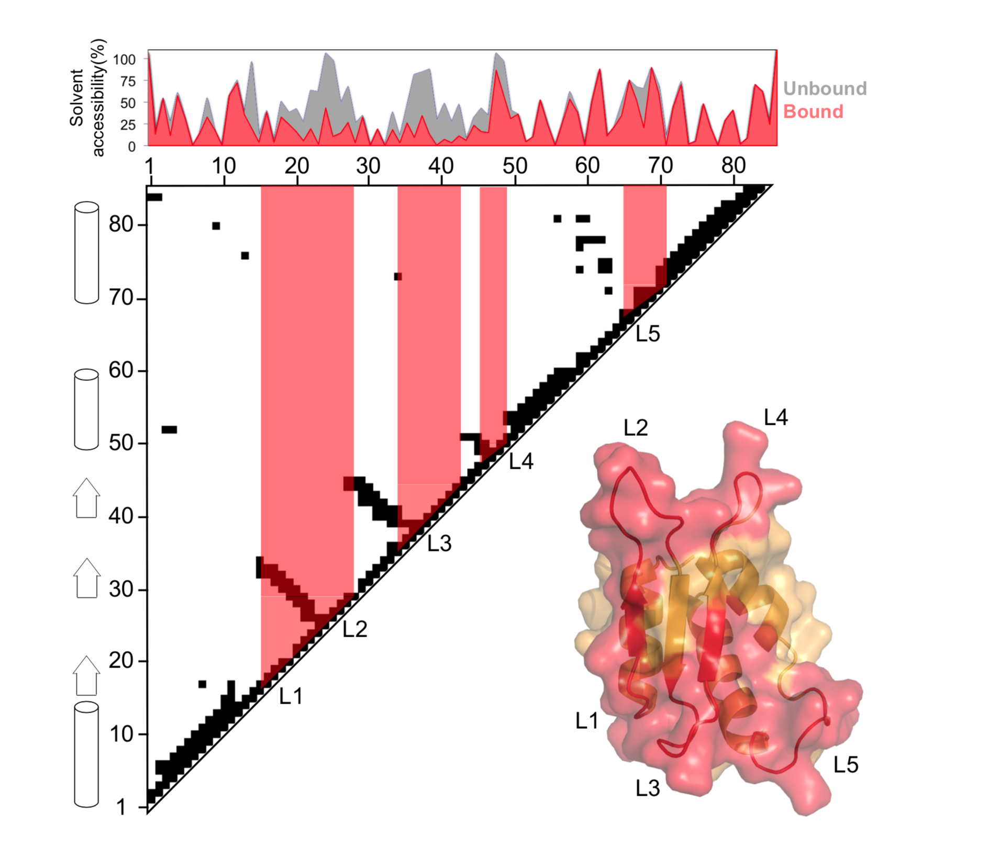

# anti-CRISPR-designs
Repo for publications of Engineered anti-CRISPR proteins for optogenetic control of CRISPR/Cas9

# Engineered anti-CRISPR proteins for optogenetic control of CRISPR/Cas9
Repository for the computational part of the paper.

## asLOV2 AcrIIA4 fusion protein remodel with the binder (SpyCas9-sgRNA)
The RosettaRemodel application [DOI:10.1371/journal.pone.0024109] was used to generate the LOV2-arc fusion protein in presence of the binder. The two input structures were SpyCas9-sgRNA-AcrIIA4 (PDB 5VW1) and the LOV2 from Avena sativa (PDB 2V0W) domain the two end terminal helices of the LOV2 domain were rebuilt using loop fragments, followed by cyclic coordinate descent (CCD) and kinematic closure (KIC) refinements. A total of 331 decoys passed the chain break filter (out of 2’500 decoys in total). In a second step, the 331 output decoys clustered with an R.M.S.D. threshold of 10 Å using Rosetta’s clustering tool and minimized (without the binder) using Rosetta’s MinMover. The 331 structures yielded 6 clusters in total. For the three largest clusters, the best scoring decoys were picked and visualized.

## Computational interface design of AcrIIA4
A first round of computational interface design was carried on the full interface for a total of 500 decoys. A silico saturation mutagenesis was carried out for residues that seemed coupled. Decoys with a lower ddG score than the baseline (wildtype) were manually inspected and the best mutations were selected. In total 10 singletons, 1 doubleton (S46D and N48K, a coupled mutation) and 13 combinations (with number of mutations ranging from 2 to 4) were generated. All mutations for the combinatorial designs are all within a (sequence)range of 15 residues.

