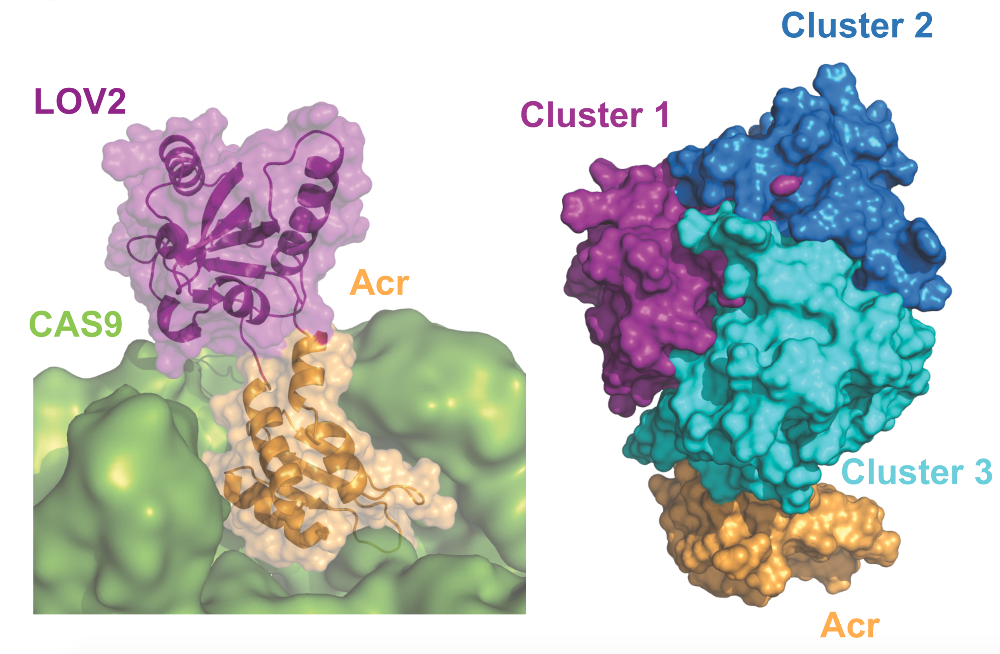

# Engineered anti-CRISPR proteins for optogenetic control of CRISPR/Cas9
Repository for the computational part of the paper.

- Felix Bubeck, Mareike D. Hoffmann, Zander Harteveld, Sabine Aschenbrenner, Andreas Bietz, Max C. Waldhauer, Kathleen Börner, Julia Fakhiri, Carolin Schmelas, Laura Dietz, Dirk Grimm, Bruno E. Correia, Roland Eils, Dominik Niopek. 2018. *Engineered anti-CRISPR proteins for optogenetic control of CRISPR/Cas9*.

## asLOV2 AcrIIA4 domain assembly with the binder (SpyCas9-sgRNA)
To generate the domain fusions between the LOV and the Acr domains we used the Rosetta Remodel application. We used two input structures, the  SpyCas9-sgRNA-AcrIIA426 (PDB 5VW1) complex and the LOV2 domain from Avena sativa (PDB 2V0W), the C and N terminal helices of the LOV2 domain were rebuilt using loop fragments, followed by cyclic coordinate descent (CCD) and kinematic closure (KIC) refinement. A total of 331 decoys passed the chain break filter out of 2’500 decoys attempted. In a second step, the 331 output decoys were clustered with an RMSD threshold of 10 Å using Rosetta’s clustering tool and further minimized. The 331 structures yielded in total 6 clusters and the best scoring decoys of the top 3 populated clusters were selected to illustrate the potential structural diversity of the ACR-LOV fusion. 

## Computational design of improved Acr-Lov mutants
Computational interface design was carried out on the full interface for a total of 500 decoys. In silico saturation mutagenesis was performed for all the interface residues in Acr using the RosettaScripts application. Designs with interaction energies (ddGs) within the same range or lower than that of the wild-type complex, were manually inspected and the best mutations were selected for experimental characterization.

Rosetta version used: 2d4add5760f905a54da645321a011e7d051c9440
